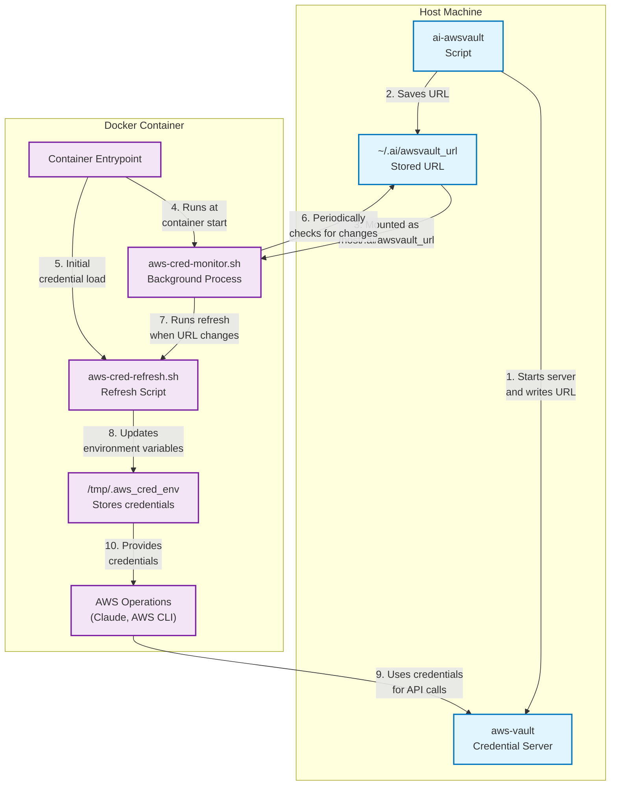

# AI Sandbox

A turn-key workflow for spinning up isolated AI development sandboxes for every Git branch on your machine. Seamlessly switch between branches while keeping your development environment and AI assistants isolated and branch-specific.

## Table of Contents
- [Why AI Sandbox?](#why-ai-sandbox)
- [Getting Started](#getting-started)
- [Common Use Cases](#common-use-cases)
- [Command Reference](#command-reference)
- [Configuration](#configuration)
- [Extending](#extending)
- [Uninstallation](#uninstallation)
- [Technical Details](#technical-details)

## Why AI Sandbox?

- 🌿 **Branch-isolated environments**: Every feature branch gets its own container and workspace
- 🔄 **Switch contexts instantly**: Jump between different branches without environment conflicts
- 🤖 **AI assistant integration**: Claude available in every workspace, with AWS credentials handled automatically
- 🚀 **Fast workflow**: Simple commands for the entire dev cycle: create, develop, test, and clean up
- 🔌 **IDE options**: Work in Claude Code, VS Code, or Cursor - your choice!

## Features

- **Per-branch isolation**: Each Git branch gets its own container and work-tree
- **AWS Bedrock integration**: Connect to Claude via AWS Bedrock credentials
- **Minimal footprint**: Alpine-based container with essential dev tools
- **Simple commands**: Easy-to-use scripts for the entire workflow
- **Resource control**: Limit CPU and memory usage as needed
- **Easy installation**: Install in any repository with a single command

## Getting Started

### Prerequisites

- **macOS** (tested on Ventura & Sonoma)
- **AWS access** with a valid SSO profile in `~/.aws/config` (e.g. `[profile dev-sso]`)

### 1. Install Required Tools

```bash
# Install required packages
brew install colima docker aws-vault

# Optional but recommended for better experience
brew install direnv   # For automatic PATH integration

# Start Docker
colima start --cpu 4 --memory 8
```

### 2. Install AI Sandbox

```bash
# Clone this repository
git clone https://github.com/dil-ddaradics/ai-sandbox.git

# Install into your project
./ai-sandbox/install.sh ~/path/to/your/project
```

After installation, you'll see:
```
✔ AI sandbox scripts installed in /path/to/your/project
```

### 3. Set Up AWS Credentials

```bash
# Navigate to your project
cd ~/path/to/your/project

# Start the AWS credential server (replace dev-sso with your profile)
ai-awsvault dev-sso
```

### 4. Start a Branch Environment

```bash
# For current branch
ai-up

# Or for a specific branch (creates it if needed)
ai-up feature/my-cool-feature
```

### 5. Launch Your IDE of Choice

```bash
# Launch Claude Code (default)
ai-chat

# Launch VS Code
ai-chat code

# Launch Cursor (falls back to VS Code if not available)
ai-chat cursor
```

### Path Integration

AI Sandbox automatically adds commands to your PATH in two ways:

1. **With direnv** (recommended): Commands are available automatically when you enter the repository directory
2. **Without direnv**: Run commands from your repository root, or add to PATH manually:
   ```bash
   export PATH="$PATH:$(pwd)/.ai/scripts"  # Add to shell config for persistence
   ```

## Common Use Cases

### Working on Multiple Features Simultaneously

AI Sandbox makes it easy to work on multiple features in parallel:

```bash
# Create environment for first feature
ai-up feature/auth-improvements
ai-chat code  # Open VS Code for this feature

# In a new terminal, create environment for second feature
ai-up feature/new-api-endpoint
ai-chat  # Open Claude in this environment

# Each environment is completely isolated
```

### Managing Your Daily Workflow

```bash
# Morning: Start where you left off
cd ~/projects/my-app
ai-awsvault dev-sso  # Start/refresh credentials if needed
ai-up  # Spin up your current branch

# During the day: Work with your tools of choice
ai-chat  # Use Claude for coding assistance
ai-chat code  # Use VS Code for more complex editing

# Evening: Clean up when done
ai-stop  # Stop the container but keep the worktree
# OR
ai-clean  # Remove container and worktree completely
```

### Collaborating with Team Members

When someone shares a branch with you:

```bash
# Pull latest changes
git fetch

# Create isolated environment for their branch
ai-up origin/teammate/feature-branch

# Review their code in your preferred editor
ai-chat cursor
```

### Switching Between IDEs

Seamlessly switch between different development environments:

```bash
# Start with Claude
ai-up feature/new-feature
ai-chat

# Later, continue in VS Code with the same container
ai-chat code

# Switch to Cursor for a different experience
ai-chat cursor
```

## Command Reference

```bash
# Credential Management
ai-awsvault <profile>      # Start credential server with AWS profile
ai-list-creds              # List running credential servers
ai-awsvault-stop           # Stop credential server
ai-test-creds              # Test credential handling in a container

# Environment Management
ai-up                      # Create workspace for current branch
ai-up <branch-name>        # Create workspace for specific branch
ai-stop                    # Stop the container when done for the day
ai-clean                   # Clean up the worktree and container
ai-clean --all             # Clean up and also stop credential server

# IDE Integration
ai-chat                    # Open Claude Code (default)
ai-chat code               # Open VS Code
ai-chat cursor             # Open Cursor (falls back to VS Code)
```

## Configuration

You can customize AI Sandbox behavior by creating a `.ai/.aienv` file in your repository.

### Sample Configuration

```bash
# Claude / AWS Bedrock settings
CLAUDE_CODE_USE_BEDROCK=1      # Use AWS Bedrock (1) or Claude direct API (0)
AWS_REGION=us-west-2           # AWS region for Bedrock

# Workspace location
# By default, worktrees are stored in ../worktrees relative to your repo
# WT_ROOT=/custom/path/to/worktrees  # Uncomment to override

# Docker resource allocation
CPU_LIMIT=4                    # Number of CPU cores for containers
MEM_LIMIT=8g                   # Memory limit for containers
```

### Configuration Options Explained

| Option | Default | Description |
|--------|---------|-------------|
| `CLAUDE_CODE_USE_BEDROCK` | `1` | Whether to use AWS Bedrock (`1`) or Claude direct API (`0`) |
| `AWS_REGION` | `us-west-2` | AWS region for Bedrock API calls |
| `WT_ROOT` | `../worktrees` | Directory where worktrees are stored (relative to repo root) |
| `CPU_LIMIT` | None (uses Docker default) | CPU cores allocated to each container |
| `MEM_LIMIT` | None (uses Docker default) | Memory allocated to each container |

> **Note**: When configuring `WT_ROOT`, all worktrees will be organized by repository name. For example, if your repo is named "my-project", worktrees will be created at `$WT_ROOT/my-project/branch-name`.

## Extending

There are several ways to extend AI Sandbox for your specific needs:

- **Add custom packages**: Edit `.ai/Dockerfile` and rebuild with `ai-up --force`
- **Add database sidecar**: Extend `.ai/docker-compose.yml` to include additional services
- **Configure resource limits**: Set `CPU_LIMIT` / `MEM_LIMIT` in your `.aienv` file
- **Add custom scripts**: Place them in `.ai/scripts/` to make them available in all containers

## Uninstallation

```bash
# Remove from a specific repo
./ai-sandbox/uninstall.sh ~/path/to/your/repo
```

The uninstallation process:
1. Stops any running containers associated with the repository
2. Removes the `.ai` directory containing all scripts and configuration
3. Cleans up PATH entries in `.envrc` if direnv is installed
4. Provides guidance for manual PATH cleanup if needed

---

# Technical Details

This section covers the implementation details for those interested in how AI Sandbox works under the hood.

## Architecture Overview

AI Sandbox creates an isolated development environment for each Git branch through:

1. **AWS credential management**: A credential server runs once and stays available across terminal sessions
2. **Git worktree integration**: Each branch gets its own worktree in a separate directory
3. **Docker container isolation**: Each branch runs in a separate container with its code mounted
4. **IDE integration**: Containers are connected to Claude, VS Code, or Cursor

## Directory Structure

```
Repository Root/
├── .ai/                    # AI Sandbox installation
│   ├── docker-compose.yml  # Container orchestration
│   ├── Dockerfile          # Container definition
│   ├── scripts/            # Command-line tools
│   └── .aienv              # Local configuration
└── ../worktrees/           # Default location for branch workspaces
    └── repo-name/          # Organized by repository name
        ├── branch1/        # One directory per branch
        └── branch2/        # Each with its own container
```

## Credential Handling Flow

AI Sandbox uses a dynamic credential system that automatically adapts to changes in AWS credentials:



Key aspects of the credential flow:

1. The `ai-awsvault` script starts the credential server and writes the URL to a file
2. Containers monitor this file for changes and automatically refresh credentials
3. Local URLs (127.0.0.1) are translated to Docker-accessible addresses (host.docker.internal)
4. Credential refreshes happen in the background without container restarts

## Claude Integration

The container is pre-configured with settings for Claude:

- A `~/.claude.json` file skips onboarding and enables permissions bypass
- Claude runs as a non-root user with appropriate permissions
- The container includes tools commonly needed for development tasks

This setup allows Claude to run smoothly in a containerized environment without the usual setup steps required on a local machine.