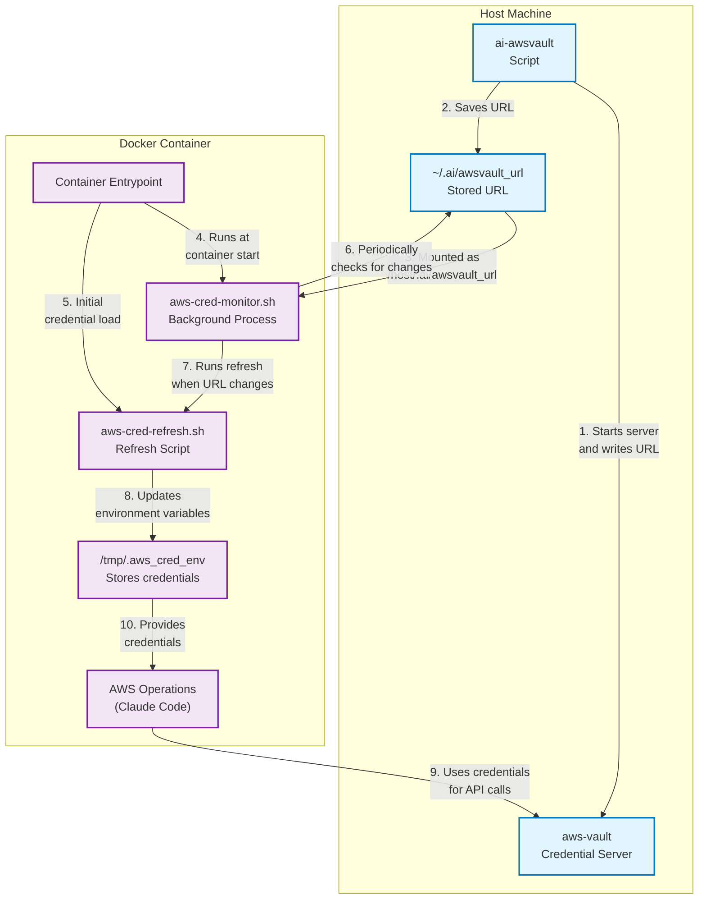

# AI Sandbox

A turn-key workflow for spinning up isolated AI development sandboxes for every Git work-tree on your machine.

## Features

- **Per-branch isolation**: Each Git branch gets its own container and work-tree
- **AWS Bedrock integration**: Connect to Claude via AWS Bedrock credentials
- **Minimal footprint**: Alpine-based container with essential dev tools
- **Simple commands**: Easy-to-use scripts for the entire workflow
- **Resource control**: Limit CPU and memory usage as needed
- **Easy installation**: Install in any repository with a single command

## Prerequisites

- **macOS** (tested on Ventura & Sonoma)
- **Homebrew packages**:
  ```bash
  brew install colima docker aws-vault
  colima start --cpu 4 --memory 8
  ```
- **Optional packages**:
  ```bash
  brew install direnv   # For automatic PATH integration
  ```
- A valid **AWS SSO profile** in `~/.aws/config` (e.g. `[profile dev-sso]`)

## Installation

```bash
# Clone this repository
git clone https://github.com/dil-ddaradics/ai-sandbox.git

# Install into your project
./ai-sandbox/install.sh ~/path/to/your/repo
```

### Path Integration

AI Sandbox supports two ways to access the `ai-*` commands from anywhere in your repository:

1. **With direnv** (recommended): If you have [direnv](https://direnv.net/) installed, the installation script will automatically configure `.envrc` to add the scripts to your PATH when you navigate to your repository.

2. **Without direnv**: You'll need to either:
   - Run commands from your repository root
   - Add the scripts directory to your PATH manually: 
     ```bash
     export PATH="$PATH:/path/to/your/repo/.ai/scripts"
     ```

## Usage

```bash
# Credential Management
ai-awsvault dev-sso        # Start credential server (run once)
ai-list-creds              # List running credential servers
ai-awsvault-stop           # Stop credential server
ai-test-creds              # Test credential handling in a container

# Container Management
ai-up                      # Spin up container + work-tree for current branch
ai-up feature/other        # Or directly specify a branch (will create if needed)
ai-chat                    # Open Claude chat interface
ai-stop                    # Stop the container when done for the day
ai-clean                   # Clean up the work-tree and container
ai-clean --all             # Clean up and also stop credential server
```

## Configuration

You can override default settings by creating a `.ai/.aienv` file in your repository:

```bash
# Claude / Bedrock
CLAUDE_CODE_USE_BEDROCK=1
AWS_REGION=us-west-2

# Work-tree parking lot (uncomment and customize to override default)
# WT_ROOT=/custom/path/to/worktrees  # Default: ../worktrees relative to repo root

# Docker resource hints
CPU_LIMIT=4
MEM_LIMIT=8g
```

## How It Works

AI Sandbox creates an isolated development environment for each Git branch by:

1. **Setting up AWS authentication**: Runs a credential server once that stays available across terminal sessions
2. **Creating branch workspaces**: Each branch gets its own Git worktree in a separate directory
3. **Running isolated containers**: Spins up Docker containers that mount your branch-specific code
4. **Connecting to Claude**: Uses AWS Bedrock to access Claude inside your container

When you run `ai-awsvault`, it starts an AWS credential server and saves the connection URL. This URL persists between terminal sessions, so you only need to run it once per machine reboot. The containers have a dynamic credential system that monitors for credential URL changes, so even if the credential server restarts with a different URL, your containers will automatically reconnect without needing to be restarted. When you run `ai-up`, it creates a separate worktree for your current branch and launches a container with that code mounted inside.

### Credential Handling Flow



The diagram illustrates how credentials flow through the system:

1. The `ai-awsvault` script starts the credential server and writes the URL
2. The URL is saved to `~/.ai/awsvault_url` on the host machine
3. This file is mounted into the container as `/host/.ai/awsvault_url`
4. When a container starts, the entrypoint script launches a monitor process
5. The entrypoint also loads credentials initially
6. The monitor process periodically checks if the URL file has changed
7. When changes are detected, the refresh script is called
8. The refresh script updates environment variables and saves them to `/tmp/.aws_cred_env`
9. AWS operations use these environment variables to get fresh credentials
10. The credential server handles token expiration automatically

The result is a clean, isolated environment where you can work with Claude on each branch without interference from other branches or projects.

### Claude Configuration

The container is pre-configured with a `~/.claude.json` file for the claude-user that:

- Skips the initial Claude onboarding process
- Enables the use of `--dangerously-skip-permissions` flag by default

This configuration allows the Claude CLI to run smoothly in a containerized environment without requiring interactive setup steps. The `--dangerously-skip-permissions` flag is necessary in a container environment since the permissions system is designed for local machine usage and can be overly restrictive inside a container.

## Extending

- **Add packages**: Edit `Dockerfile` and rebuild
- **Database sidecar**: Extend `docker-compose.yml`
- **Resource limits**: Set `CPU_LIMIT` / `MEM_LIMIT` in `.aienv`

## Uninstallation

```bash
# Remove from a specific repo
./uninstall.sh ~/path/to/your/repo
```

The uninstallation process:
1. Stops any running containers associated with the repository
2. Removes the `.ai` directory containing all scripts and configuration
3. Cleans up PATH entries in `.envrc` if direnv is installed
4. Provides guidance for manual PATH cleanup if needed

If you've manually added the scripts to your PATH, you'll need to remove those entries from your shell configuration files.